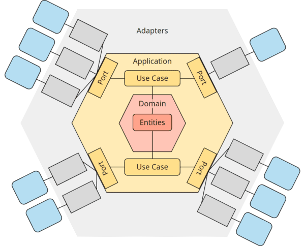
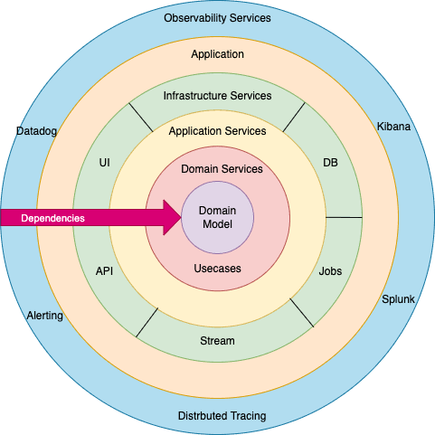

[Back to interview](../interview.md)

# Architecture

<!-- TOC -->
* [Architecture](#architecture)
  * [Monolith](#monolith)
    * [Questions](#questions)
  * [Hexagonal architecture](#hexagonal-architecture)
    * [Questions](#questions-1)
  * [Clean architecture](#clean-architecture)
    * [Questions](#questions-2)
  * [Onion architecture](#onion-architecture)
    * [Questions](#questions-3)
  * [Hexagonal vs Clean vs Onion architectures](#hexagonal-vs-clean-vs-onion-architectures)
  * [Microservices](#microservices)
<!-- TOC -->

## Monolith

Monolithic architecture is a traditional software design where an application is built as a single, unified unit, with all its components (UI, business logic, data access) tightly coupled in one codebase and **deployed as one artifact**.

### Questions

**Question 1**: Describe the advantages and disadvantages.

**Advantages:** 

✅ Easier to develop and set up initially  
✅ End-to-end testing is straightforward  
✅ Faster iteration cycles for small teams  

**Disadvantages (as it grows):** 

⚠️ Maintenance Challenges: High code coupling can lead to "spaghetti code," making debugging hard.  
⚠️ Scalability Issues: Must scale the entire application even if only one part needs more resources.  
⚠️ Slower Development: Small changes require redeploying the whole system, slowing CI/CD.  

---

## Hexagonal architecture

Hexagonal Architecture (or **Ports & Adapters**) is a software design pattern that **isolates the core business logic (domain) from external concerns** like UIs, databases, and third-party services, making the application flexible, maintainable, and testable.   
It achieves this **by defining** technology-agnostic **interfaces** called **Ports (e.g. `UserRepository`)** within the core, which are **then implemented by 
Adapters** (e.g. `UserDatabaseRepository`, `UserFileSystemRepository`) that handle specific technologies, allowing easy swapping of external components without affecting the business rules.

### Questions

**Question 1**: Describe the advantages and disadvantages.

**Advantages:** 

✅ Decoupling: Protects business logic from infrastructure changes (databases, UIs).  
✅ Testability: Business logic can be tested in isolation, without needing a database or UI.  
✅ Flexibility: Easily switch out technologies (e.g., change from SQL to NoSQL) by swapping adapters.  
✅ Domain-Centric: Focuses development on the core business rules.  

**Disadvantages:**

⚠️ Maintenance Challenges: It can be excessive in small projects.

---

## Clean architecture

Clean Architecture is a software design philosophy introduced by Robert C. Martin ("Uncle Bob") that **emphasizes the separation of concerns by organizing code into concentric layers**. 
Its primary objective is to create systems that are independent of frameworks, UI, and databases, making them highly testable and maintainable over the long term.

ℹ️ **Core principles**

- **The Dependency Rule**: Dependencies must always point inward. Code in an inner layer cannot know anything about the functions, classes, or variables defined in an outer layer.
- **Separation of Concerns**: Each layer has a specific responsibility, keeping business logic isolated from technical implementation details.
- **Framework-Independent**: The system doesn't rely on the existence of any particular library or framework.
- **UI-Independent**: The UI can change from a Web API to a console app without changing any business rules.
- **Database-Independent**: You can swap out SQL for NoSQL without affecting the core logic.
- It focuses on use cases.
- The idea that the folder structure should "scream" what the application does, not what frameworks it uses.

ℹ️ **The Four Layers**

Most implementations follow this standard "onion" structure:
- **Entities (Inner Circle)**: Contains enterprise-wide business rules. These are the most high-level, stable objects that change the least.
- **Use Cases**: Contains application-specific business rules. This layer orchestrates the flow of data to and from the entities e.g. `CreateOrder`, `MakeReservation`, `ScheduleShutdown`
- **Interface Adapters**: Converts data from the format most convenient for use cases and entities into the format most convenient for external agencies like the Web or Database (e.g., Controllers, Presenters, Gateways).
- **Frameworks & Drivers (Outer Circle)**: The outermost layer composed of tools like the database, web framework, and UI. This is where all the "details" live.

ℹ️ **Difference vs. Hexagonal**
- Clean formalizes layers
- Hexagonal tells you how to communicate, not how to divide packages

### Questions

**Question 1**: Describe the advantages and disadvantages.

**Advantages:** 

✅ Improved testability  
✅ Easier maintenance, and the ability to defer technical decisions (like database choice) until later in the project.

**Disadvantages:**

⚠️ It can lead to over-engineering in small projects  
⚠️ A higher learning curve, and an increased number of boilerplate files and interfaces (if implemented restrictively e.g. a dedicated DTO for every layer even if it is simple, stable and identical for every layer)

---

## Onion architecture

Onion Architecture is a software design pattern that **emphasizes separation of concerns by structuring an application into concentric layers**, ensuring the core business logic remains independent of external concerns like databases or UIs.

ℹ️ **Core principles**

- **The Dependency Rule**: The fundamental principle is that all dependencies flow inward. Inner layers must not depend on outer layers. This ensures the core of the application remains isolated from specific technology implementations.
- **Domain at the Core**: The heart of the application is the domain model (business entities and rules), which is independent of any infrastructure or application services.
- **Interfaces and Inversion of Control (IoC)**: Layers interact through interfaces defined by the inner layers and implemented by the outer layers. IoC and Dependency Injection are used to manage these relationships at runtime.

ℹ️ **Key Layers**

While the exact number of layers can vary, a typical Onion Architecture consists of:
- **Domain Layer (Innermost)**: Contains the core business logic, entities, and enterprise-wide rules. It has no dependencies on other layers.
- **Application Layer**: Contains application-specific business rules and use cases. It orchestrates the flow of data to and from the domain layer and defines interfaces (ports) for external services.
- **Infrastructure Layer**: The outermost layer containing implementations of interfaces defined in the inner layers. This is where databases (ORMs), external APIs, logging, and UI frameworks reside.
- **Presentation Layer (Optional/Part of Infrastructure)**: Deals with user interfaces (e.g., web pages, APIs) and user interactions.

### Questions

**Question 1**: Describe the advantages and disadvantages.

**Advantages:** 

✅ The benefits of the Onion Architecture largely stem from its strict adherence to the Dependency Inversion Principle, where the inner layers (the core business logic) are completely isolated.  
✅ Testability: The core business rules and application logic do not depend on external components like databases or UI frameworks, making them easy to unit test in isolation using mocks or in-memory databases.  
✅ High Maintainability and Flexibility: Changes in external technologies (e.g., swapping a SQL database for NoSQL or changing from a web UI to a console app) have minimal impact on the inner business logic, significantly reducing maintenance costs over the software's lifespan.  
✅ Decoupling and Loose Coupling: Dependencies consistently point inward toward the domain model. This loose coupling makes the system more modular and robust, as components can be developed and updated independently.  
✅ Domain-Centric Design: The architecture enforces a focus on the core business domain and use cases from the start, rather than being dictated by the constraints of a specific database or UI technology.  

**Disadvantages:**

⚠️ **Increased Complexity for Small Projects**: For simple applications (like basic CRUD operations or short-lived prototypes), the elaborate layering and extra boilerplate code can introduce unnecessary complexity, potentially outweighing the benefits.  
⚠️ **More Boilerplate Code**: Managing multiple projects/layers, mapping data transfer objects (DTOs) between layers, and defining numerous interfaces increases the overall code volume and initial development time.  
⚠️ **Potential Performance Overhead**: The process of mapping data objects across several abstraction layers can introduce minor runtime overhead compared to a simple, tightly coupled architecture.  

---

## Hexagonal vs Clean vs Onion architectures

🔥 **Key Differences**

| Aspect               | Hexagonal Architecture | Clean Architecture    | Onion Architecture |
|----------------------|------------------------|-----------------------|--------------------|
| Starting point       | Ports & Adapters       | Use Cases             | Domain objects     |
| Metaphor             | Sockets / adapters     | Concentric circles    | Onion layers       |
| Primary focus        | Integrations           | Application use cases | Domain model       |
| Dependency direction | Inward                 | Inward                | Inward             |
| Closeness to DDD     | ⭐⭐⭐⭐                   | ⭐⭐⭐                   | ⭐⭐⭐⭐⭐              |
| Boilerplate          | Medium                 | High                  | Medium             |

ℹ️ **One-sentence intuition**

**Hexagonal asks**: **How** does the application **
talk** to the outside world?  
**Clean asks**: **What does** the application do (use cases)?  
**Onion asks**: **What is** the core **
business** domain?  

---

## Microservices

Evolving style where applications are built as a collection of small, independent services. Each service focuses on a single business capability and communicates via lightweight protocols like REST, gRPC, or message brokers.

ℹ️ **Core principles**

- **Independent Deployability**: Each service can be updated and deployed without affecting the rest of the system.  
- **Loose Coupling**: Services are self-contained with their own databases, ensuring that internal changes in one don't require changes in others.  
- **Single Responsibility**: Every service is built around a specific task or "bounded context" from domain-driven design.  
- **Polyglot Programming**: Teams can choose the best technology stack for each individual service.   

### Questions

**Question 1**: Describe the advantages and disadvantages.

**Advantages:** 

✅ **Granular Scalability**: You can scale only the services under high load (e.g., a "search" service during a sale) rather than the entire application, optimizing cloud costs.  
✅ **Fault Isolation**: If one service fails (e.g., the "reviews" module), the rest of the application (e.g., "checkout") remains functional, preventing total system crashes.  
✅ **Increased Agility**: Smaller codebases allow for faster feature releases and shorter time-to-market as teams work autonomously.  
✅ **Resilience**: Modern implementations often use "cells" to isolate failures and redirect traffic to operational units.  

**Disadvantages:**

⚠️ **Operational Complexity**: Managing hundreds of services requires heavy investment in DevOps, container orchestration (like Kubernetes), and service meshes (like Istio).  
⚠️ **Data Consistency**: Distributed transactions are difficult; maintaining data integrity across separate databases often requires complex patterns like the Saga Pattern.  
⚠️ **High Network Latency**: Inter-service calls over a network are slower than in-process calls in a monolith, potentially impacting performance.  
⚠️ **Observability Hurdles**: Debugging becomes significantly harder as requests move through multiple services.

---