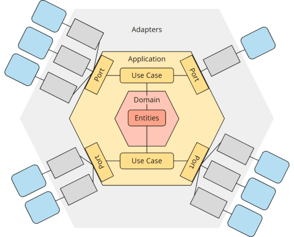
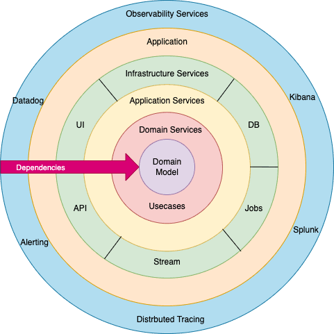

[Back to interview](../interview.md)

# Architecture

<!-- TOC -->
* [Architecture](#architecture)
  * [Monolith](#monolith)
    * [Questions](#questions)
  * [Hexagonal architecture](#hexagonal-architecture)
    * [Questions](#questions-1)
  * [Clean architecture](#clean-architecture)
    * [Questions](#questions-2)
  * [Onion architecture](#onion-architecture)
    * [Questions](#questions-3)
  * [Hexagonal vs Clean vs Onion architectures](#hexagonal-vs-clean-vs-onion-architectures)
  * [Microservices](#microservices)
    * [Questions](#questions-4)
  * [CQRS](#cqrs)
    * [What is CQRS?](#what-is-cqrs)
    * [The Core Idea](#the-core-idea)
    * [Commands vs Queries](#commands-vs-queries)
    * [Simple CQRS (Same Database)](#simple-cqrs-same-database)
    * [Full CQRS (Separate Read & Write Models)](#full-cqrs-separate-read--write-models)
    * [Why Use CQRS?](#why-use-cqrs)
    * [CQRS + Event Sourcing Relationship](#cqrs--event-sourcing-relationship)
    * [Benefits](#benefits)
    * [Trade-Offs](#trade-offs)
    * [Eventual Consistency](#eventual-consistency)
    * [When to Use CQRS?](#when-to-use-cqrs)
  * [✉️ Event Sourcing](#-event-sourcing)
    * [What Is Event Sourcing?](#what-is-event-sourcing)
    * [How It Works](#how-it-works)
    * [Aggregates](#aggregates)
    * [Event Store](#event-store)
    * [🏗️ Rebuilding State](#-rebuilding-state)
    * [Snapshots](#snapshots)
    * [Event Sourcing & CQRS](#event-sourcing--cqrs)
    * [Advantages](#advantages)
    * [Trade-Offs](#trade-offs-1)
    * [Event Schema Evolution](#event-schema-evolution)
    * [Optimistic Locking](#optimistic-locking)
    * [Eventual Consistency](#eventual-consistency-1)
    * [When NOT to Use Event Sourcing](#when-not-to-use-event-sourcing)
    * [Production Concerns](#production-concerns)
<!-- TOC -->

## Monolith

Monolithic architecture is a traditional software design where an application is built as a single, unified unit, with all its components (UI, business logic, data access) tightly coupled in one codebase and **deployed as one artifact**.

### Questions

**Question 1**: Describe the advantages and disadvantages.

<span style='color:green'>**Advantages:** </span>

✅ Easier to develop and set up initially  
✅ End-to-end testing is straightforward  
✅ Faster iteration cycles for small teams  

<span style='color:goldenrod'>**Disadvantages (as it grows):**</span> 

⚠️ Maintenance Challenges: High code coupling can lead to "spaghetti code," making debugging hard.  
⚠️ Scalability Issues: Must scale the entire application even if only one part needs more resources.  
⚠️ Slower Development: Small changes require redeploying the whole system, slowing CI/CD.  

---
<div style="break-after: page;"></div>

## Hexagonal architecture

Hexagonal Architecture (or **<span style='color:darkseagreen'>Ports & Adapters</span>**) is a software design pattern that **isolates the core business logic (domain) from external concerns** like UIs, databases, and third-party services, making the application flexible, maintainable, and testable.   
It achieves this **by defining** technology-agnostic **interfaces** called **<span style='color:darkseagreen'>Ports</span> (e.g. `UserRepository`)** within the core, which are **then implemented by <span style='color:darkseagreen'>
Adapters</span>** (e.g. `UserDatabaseRepository`, `UserFileSystemRepository`) that handle specific technologies, allowing easy swapping of external components without affecting the business rules.



### Questions

**Question 1**: Describe the advantages and disadvantages.

<span style='color:green'>**Advantages:** </span>

✅ Decoupling: Protects business logic from infrastructure changes (databases, UIs).  
✅ Testability: Business logic can be tested in isolation, without needing a database or UI.  
✅ Flexibility: Easily switch out technologies (e.g., change from SQL to NoSQL) by swapping adapters.  
✅ Domain-Centric: Focuses development on the core business rules.  

<span style='color:goldenrod'>**Disadvantages:**</span>

⚠️ Maintenance Challenges: It can be excessive in small projects.

---
<div style="break-after: page;"></div>

## Clean architecture

Clean Architecture is a software design philosophy introduced by Robert C. Martin ("Uncle Bob") that **emphasizes the separation of concerns by organizing code into concentric layers**. 
Its primary objective is to create systems that are independent of frameworks, UI, and databases, making them highly testable and maintainable over the long term.

ℹ️ **Core principles**

- **The Dependency Rule**: Dependencies must always point inward. Code in an inner layer cannot know anything about the functions, classes, or variables defined in an outer layer.
- **Separation of Concerns**: Each layer has a specific responsibility, keeping business logic isolated from technical implementation details.
- **Framework-Independent**: The system doesn't rely on the existence of any particular library or framework.
- **UI-Independent**: The UI can change from a Web API to a console app without changing any business rules.
- **Database-Independent**: You can swap out SQL for NoSQL without affecting the core logic.
- It focuses on use cases.
- The idea that the folder structure should "scream" what the application does, not what frameworks it uses.

ℹ️ **The Four Layers**

Most implementations follow this standard "onion" structure:
- **Entities (Inner Circle)**: Contains enterprise-wide business rules. These are the most high-level, stable objects that change the least.
- **Use Cases**: Contains application-specific business rules. This layer orchestrates the flow of data to and from the entities e.g. `CreateOrder`, `MakeReservation`, `ScheduleShutdown`
- **Interface Adapters**: Converts data from the format most convenient for use cases and entities into the format most convenient for external agencies like the Web or Database (e.g., Controllers, Presenters, Gateways).
- **Frameworks & Drivers (Outer Circle)**: The outermost layer composed of tools like the database, web framework, and UI. This is where all the "details" live.


ℹ️ **Difference vs. Hexagonal**
- Clean formalizes layers
- Hexagonal tells you how to communicate, not how to divide packages

### Questions

**Question 1**: Describe the advantages and disadvantages.

<span style='color:green'>**Advantages:** </span>

✅ Improved testability  
✅ Easier maintenance, and the ability to defer technical decisions (like database choice) until later in the project.

<span style='color:goldenrod'>**Disadvantages:**</span>

⚠️ It can lead to over-engineering in small projects  
⚠️ A higher learning curve, and an increased number of boilerplate files and interfaces (if implemented restrictively e.g. a dedicated DTO for every layer even if it is simple, stable and identical for every layer)

---
<div style="break-after: page;"></div>

## Onion architecture

Onion Architecture is a software design pattern that **emphasizes separation of concerns by structuring an application into concentric layers**, ensuring the core business logic remains independent of external concerns like databases or UIs.

ℹ️ **Core principles**

- **The Dependency Rule**: The fundamental principle is that all dependencies flow inward. Inner layers must not depend on outer layers. This ensures the core of the application remains isolated from specific technology implementations.
- **Domain at the Core**: The heart of the application is the domain model (business entities and rules), which is independent of any infrastructure or application services.
- **Interfaces and Inversion of Control (IoC)**: Layers interact through interfaces defined by the inner layers and implemented by the outer layers. IoC and Dependency Injection are used to manage these relationships at runtime.

ℹ️ **Key Layers**

While the exact number of layers can vary, a typical Onion Architecture consists of:
- **Domain Layer (Innermost)**: Contains the core business logic, entities, and enterprise-wide rules. It has no dependencies on other layers.
- **Application Layer**: Contains application-specific business rules and use cases. It orchestrates the flow of data to and from the domain layer and defines interfaces (ports) for external services.
- **Infrastructure Layer**: The outermost layer containing implementations of interfaces defined in the inner layers. This is where databases (ORMs), external APIs, logging, and UI frameworks reside.
- **Presentation Layer (Optional/Part of Infrastructure)**: Deals with user interfaces (e.g., web pages, APIs) and user interactions.



### Questions

**Question 1**: Describe the advantages and disadvantages.

<span style='color:green'>**Advantages:** </span>

✅ The benefits of the Onion Architecture largely stem from its strict adherence to the Dependency Inversion Principle, where the inner layers (the core business logic) are completely isolated.  
✅ Testability: The core business rules and application logic do not depend on external components like databases or UI frameworks, making them easy to unit test in isolation using mocks or in-memory databases.  
✅ High Maintainability and Flexibility: Changes in external technologies (e.g., swapping a SQL database for NoSQL or changing from a web UI to a console app) have minimal impact on the inner business logic, significantly reducing maintenance costs over the software's lifespan.  
✅ Decoupling and Loose Coupling: Dependencies consistently point inward toward the domain model. This loose coupling makes the system more modular and robust, as components can be developed and updated independently.  
✅ Domain-Centric Design: The architecture enforces a focus on the core business domain and use cases from the start, rather than being dictated by the constraints of a specific database or UI technology.  

<span style='color:goldenrod'>**Disadvantages:**</span>

⚠️ **Increased Complexity for Small Projects**: For simple applications (like basic CRUD operations or short-lived prototypes), the elaborate layering and extra boilerplate code can introduce unnecessary complexity, potentially outweighing the benefits.  
⚠️ **More Boilerplate Code**: Managing multiple projects/layers, mapping data transfer objects (DTOs) between layers, and defining numerous interfaces increases the overall code volume and initial development time.  
⚠️ **Potential Performance Overhead**: The process of mapping data objects across several abstraction layers can introduce minor runtime overhead compared to a simple, tightly coupled architecture.  

---
<div style="break-after: page;"></div>

## Hexagonal vs Clean vs Onion architectures

🔥 **Key Differences**

| Aspect               | Hexagonal Architecture | Clean Architecture    | Onion Architecture |
|----------------------|------------------------|-----------------------|--------------------|
| Starting point       | Ports & Adapters       | Use Cases             | Domain objects     |
| Metaphor             | Sockets / adapters     | Concentric circles    | Onion layers       |
| Primary focus        | Integrations           | Application use cases | Domain model       |
| Dependency direction | Inward                 | Inward                | Inward             |
| Closeness to DDD     | ⭐⭐⭐⭐                   | ⭐⭐⭐                   | ⭐⭐⭐⭐⭐              |
| Boilerplate          | Medium                 | High                  | Medium             |


ℹ️ **One-sentence intuition**

**Hexagonal asks**: **<span style='color:darkseagreen'>How</span>** does the application **<span style='color:darkseagreen'>
talk</span>** to the outside world?  
**Clean asks**: **<span style='color:darkseagreen'>What does</span>** the application do (use cases)?  
**Onion asks**: **<span style='color:darkseagreen'>What is</span>** the core **<span style='color:darkseagreen'>
business</span>** domain?  

---
<div style="break-after: page;"></div>

## Microservices

Evolving style where applications are built as a collection of small, independent services. Each service focuses on a single business capability and communicates via lightweight protocols like REST, gRPC, or message brokers.

ℹ️ **Core principles**

- **Independent Deployability**: Each service can be updated and deployed without affecting the rest of the system.  
- **Loose Coupling**: Services are self-contained with their own databases, ensuring that internal changes in one don't require changes in others.  
- **Single Responsibility**: Every service is built around a specific task or "bounded context" from domain-driven design.  
- **Polyglot Programming**: Teams can choose the best technology stack for each individual service.   

### Questions

**Question 1**: Describe the advantages and disadvantages.

<span style='color:green'>**Advantages:** </span>

✅ **Granular Scalability**: You can scale only the services under high load (e.g., a "search" service during a sale) rather than the entire application, optimizing cloud costs.  
✅ **Fault Isolation**: If one service fails (e.g., the "reviews" module), the rest of the application (e.g., "checkout") remains functional, preventing total system crashes.  
✅ **Increased Agility**: Smaller codebases allow for faster feature releases and shorter time-to-market as teams work autonomously.  
✅ **Resilience**: Modern implementations often use "cells" to isolate failures and redirect traffic to operational units.  

<span style='color:goldenrod'>**Disadvantages:**</span>

⚠️ **Operational Complexity**: Managing hundreds of services requires heavy investment in DevOps, container orchestration (like Kubernetes), and service meshes (like Istio).  
⚠️ **Data Consistency**: Distributed transactions are difficult; maintaining data integrity across separate databases often requires complex patterns like the Saga Pattern.  
⚠️ **High Network Latency**: Inter-service calls over a network are slower than in-process calls in a monolith, potentially impacting performance.  
⚠️ **Observability Hurdles**: Debugging becomes significantly harder as requests move through multiple services.

---

## CQRS

### What is CQRS?

**CQRS = Command Query Responsibility Segregation**

It means:

> Separate the model used for writing (commands) from the model used for reading (queries).

📌 Not just separate methods. Separate models.

### The Core Idea

🔸 **Traditional CRUD**:

```java
Same model handles:
- reads
- writes
- business logic
- persistence
```

🔸 **CQRS**:

```java
Command model → modifies state
Query model   → returns data
```

- Different responsibilities.
- Different representations.

### Commands vs Queries

🔸 **Command**

- Changes system state
- Has side effects
- Returns little or nothing
- Validates business rules

Example:

```java
CreateOrder
CancelOrder
WithdrawMoney
```

🔸 **Query**

- Reads data
- No side effects
- Returns data
- No domain logic

Example:

```java
GetOrderDetails
SearchOrders
GetBalance
```

### Simple CQRS (Same Database)

You can apply CQRS without distributed systems.

Example:

Command side:

```java
@Transactional
public void withdraw(Long accountId, BigDecimal amount)
```


Query side:

```java
public AccountBalanceDto getBalance(Long accountId)
```


You use:

- Entities for commands
- Projections / DTOs for reads

Same DB, **<span style='color:darkseagreen'>different</span>** models.  
This is often called **lightweight CQRS**.

### Full CQRS (Separate Read & Write Models)

In advanced setups:

> Command DB → Event → Projection → Read DB

🔸 ✍️ **Write model**:

- normalized
- domain-driven
- enforces invariants

🔸 📖 **Read model**:

- denormalized
- optimized for queries
- sometimes different database

Example:

```java
Write side: PostgreSQL
Read side: ElasticSearch
```

### Why Use CQRS?

Because:

> The shape of data for writes is different from shape of data for reads.

🔸 ✍️ **Write model**:

- consistency
- validation
- business rules

🔸 📖 **Read model**:

- speed
- denormalization
- complex joins avoided

### CQRS + Event Sourcing Relationship

📌 CQRS **<span style='color:hotpink'>does NOT</span>** **require** [Event Sourcing](#-event-sourcing).

But:

> Event Sourcing almost always implies CQRS.

🔸 **Why?**

Because:

- events are perfect for building projections
- read model can be rebuilt anytime

### Benefits

✅ Better scalability  
✅ Optimized read performance  
✅ Clear separation of concerns  
✅ Complex domains easier to model  
✅ Independent scaling of read/write  

### Trade-Offs

❌ Increased complexity  
❌ Eventual consistency  
❌ More infrastructure  
❌ Harder debugging  
❌ Requires mature team  

### Eventual Consistency

In full CQRS:

1. Command succeeds
2. Event stored
3. Projection updates read model asynchronously

User immediately queries ➡️ may see **<span style='color:hotpink'>stale data</span>**.  
⚠️ S**ystem must tolerate.**

### When to Use CQRS?

🔸 👍 **Good fit:**

✅ Complex domain  
✅ High read-to-write ratio  
✅ Scaling reads separately  
✅ Heavy reporting queries  
✅ Event-driven architecture  

🔸 👎 **Not good fit:**

❌ Simple CRUD app  
❌ Admin panel  
❌ Small team  
❌ No performance bottlenecks  

---

## ✉️ Event Sourcing

### What Is Event Sourcing?

Traditional systems store:

> Current state

Example:

```java
Account:
id=1
balance=500
```

Event Sourcing stores:

> All changes (events) that led to current state. It stores history of state transitions.

Example:

```java
AccountCreated(1)
MoneyDeposited(1000)
MoneyWithdrawn(500)
```

📌 Current balance is **derived** by **replaying** **events**.

---

### How It Works

Let’s say user places an order.

1. Command arrives:
    ```java
    PlaceOrderCommand
    ```
2. Aggregate loads events from store.
3. Replays events ➡️ builds current state.
4. Validates business rules.
5. Emits new event:
    ```java
    OrderPlaced
    ```
6. Event appended to event store.
7. Projections update read models.

📌 **State is derived, not stored directly.**

---

### Aggregates

Aggregate:

> Consistency boundary that enforces invariants.

Example:

```java
BankAccount aggregate
```

It **<span style='color:darkseagreen'>does</span>**:

✅ loads its events  
✅ validates command  
✅ produces new events  

It does **<span style='color:hotpink'>NOT</span>**:

❌ directly modify DB tables  

🔸 **Invariants Example**

```java
MoneyWithdrawn(amount)
```

Aggregate checks:

- `balance >= amount`

If valid:

- emit event

---

### Event Store

**Event store is:**

> Append-only log of domain events.

**Characteristics:**

✅ Immutable  
✅ Ordered per aggregate  
✅ Versioned  
✅ Optimistic locking  

🛢 **Example DB schema:**

```java
aggregate_id
version
event_type
payload
timestamp
```

--- 

### 🏗️ Rebuilding State

**When aggregate loads:**

1. Load events by `aggregate_id`
2. Replay them in order
3. Apply to state

Example:

```java
for (Event e : events) {
apply(e);
}
```

📌 **This rebuilds state in memory.**

---

### Snapshots

🔸 **Problem:**

> If aggregate has 100,000 events ➡️ replay <span style='color:hotpink'>**slow**</span>.

🔸 **Solution:**

> Snapshot.

🔸 **Every N events:**

- store full state snapshot
- replay only events after snapshot

---

### Event Sourcing & CQRS

> Often used together.

🔸 **CQRS:**

- Command side (write model)
- Query side (read model)

🔸 **Event flow:**

`Command → Aggregate → Event Store → Projection → Read DB`

🔸 **Read model:**

- denormalized
- optimized for queries

---

### Advantages

✅ Full audit log  
✅ Time travel (rebuild state at any point)  
✅ Event replay  
✅ Easy integration (events as messages)  
✅ Debugging easier  

---

### Trade-Offs

❌ Complexity  
❌ Harder debugging (async projections)  
❌ Event schema evolution problems  
❌ Eventual consistency  
❌ More infrastructure  

---

### Event Schema Evolution

> Events are immutable.

🔸 **If schema changes:**

- version events
- add upcasters
- transform old event versions

📌⚠️ **<span style='color:goldenrod'>This is non-trivial.</span>**

---

### Optimistic Locking

> Each aggregate has version.

When appending event:

`expected_version == current_version`

If mismatch:

- <span style='color:hotpink'>concurrency conflict</span>

---

### Eventual Consistency

Because read model updated asynchronously:

- Write succeeds
- Read model may lag

⚠️ **Client must tolerate.**

---

### When NOT to Use Event Sourcing

Don’t use it when:

❌ CRUD app  
❌ Simple admin panel  
❌ No audit requirements  
❌ Team not experienced  

Use it when:

✅ Complex domain logic  
✅ Strong audit needs  
✅ High traceability  
✅ Business wants historical replay  

---

### Production Concerns

- Event store scaling
- Partitioning by aggregate id
- Snapshot frequency
- Projection rebuild strategy
- Idempotent event handling
- Exactly-once vs at-least-once processing

---
