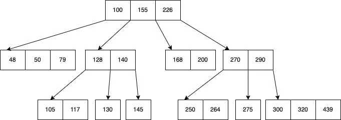

[Back to interview](../interview.md)

# 🗄️ Databases

<!-- TOC -->
* [🗄️ Databases](#-databases)
  * [🔒 Optimistic Locking](#-optimistic-locking)
    * [ℹ️ How it works](#ℹ-how-it-works)
    * [ℹ️ Pros / Cons](#ℹ-pros--cons)
    * [ℹ️ When to use](#ℹ-when-to-use)
  * [🔐 Pessimistic Locking](#-pessimistic-locking)
    * [ℹ️ How it works](#ℹ-how-it-works-1)
    * [ℹ️Pros / Cons](#ℹpros--cons)
    * [ℹ️ When to use](#ℹ-when-to-use-1)
  * [🧠 Optimistic vs Pessimistic](#-optimistic-vs-pessimistic)
  * [🔌 Connection Pool](#-connection-pool)
    * [ℹ️ How it works](#ℹ-how-it-works-2)
    * [ℹ️ Why it matters](#ℹ-why-it-matters)
    * [ℹ️ Common pool settings](#ℹ-common-pool-settings)
  * [🐞 Database Debugging](#-database-debugging)
    * [ℹ️ Step-by-step approach](#ℹ-step-by-step-approach)
  * [📇 Indexes](#-indexes)
    * [ℹ️ What indexes are good for](#ℹ-what-indexes-are-good-for)
    * [ℹ️ What indexes are bad for](#ℹ-what-indexes-are-bad-for)
    * [ℹ️ Common mistakes](#ℹ-common-mistakes)
    * [📌 Rule of thumb](#-rule-of-thumb)
    * [ℹ️ Implementation](#ℹ-implementation)
  * [📄 Pagination](#-pagination)
    * [ℹ️ Why pagination exists](#ℹ-why-pagination-exists)
    * [ℹ️ Offset-based pagination](#ℹ-offset-based-pagination)
    * [ℹ️ Keyset (cursor) pagination (preferred)](#ℹ-keyset-cursor-pagination-preferred)
  * [🧩 Partitioning](#-partitioning)
    * [ℹ️ Types](#ℹ-types)
    * [ℹ️ Why partition?](#ℹ-why-partition)
    * [ℹ️ Partitioning ≠ Sharding](#ℹ-partitioning--sharding)
  * [🧩 Sharding — horizontal scaling of databases](#-sharding--horizontal-scaling-of-databases)
  * [ℹ️ Why sharding exists](#ℹ-why-sharding-exists)
  * [ℹ️ Sharding vs Partitioning](#ℹ-sharding-vs-partitioning)
  * [ℹ️ The core idea: shard key](#ℹ-the-core-idea-shard-key)
  * [ℹ️ What breaks when you shard](#ℹ-what-breaks-when-you-shard)
<!-- TOC -->

## 🔒 Optimistic Locking

Optimistic locking assumes:

> “Conflicts are rare.”

No lock is held while reading data.

### ℹ️ How it works

- Each row has a version (number or timestamp)
- Transaction:
  1. Reads row + version
  2. Modifies data
  3. Updates row only if version didn’t change

If version changed ➡️ update fails.

**Example**

```sql
UPDATE orders
SET status = 'PAID', version = version + 1
WHERE id = 123 AND version = 5;
```

If `0 rows updated` ➡️ conflict detected.

---

### ℹ️ Pros / Cons

✅ High concurrency  
✅ No blocking  
✅ Scales well  

❌ Requires retry logic  
❌ Conflicts detected late  

---

### ℹ️ When to use

✅ Read-heavy systems  
✅ Web apps  
✅ REST APIs  

📌 Default choice in most systems

---
<div style="break-after: page;"></div>

## 🔐 Pessimistic Locking

Pessimistic locking assumes:

> “Conflicts are likely.”

Data is locked immediately.

---

### ℹ️ How it works

```sql
SELECT * FROM orders
WHERE id = 123
FOR UPDATE;
```

- Other transactions are blocked
- Lock released on commit / rollback

---

### ℹ️Pros / Cons

✅ Strong consistency  
✅ No lost updates  

❌ Blocking  
❌ Deadlocks  
❌ Poor scalability  

---

### ℹ️ When to use

✅ Financial systems  
✅ Critical invariants  
✅ Short, fast transactions  

📌 Use sparingly

---
<div style="break-after: page;"></div>

## 🧠 Optimistic vs Pessimistic

| Aspect         | Optimistic | Pessimistic |
|----------------|------------|-------------|
| Lock timing    | On write   | On read     |
| Conflicts      | Detected   | Prevented   |
| Scalability    | High       | Low         |
| Blocking       | ❌          | ✅           |
| Default choice | ✅          | ❌           |

---
<div style="break-after: page;"></div>

## 🔌 Connection Pool

> A connection pool is a cache of open DB connections.  
> Opening a DB connection is expensive.

### ℹ️ How it works

1. App starts
2. Pool opens N connections
3. Threads borrow and return connections

### ℹ️ Why it matters

✅ Performance  
✅ Resource control  
✅ Stability  

Without pooling:

- DB overwhelmed
- latency spikes
- system collapse

### ℹ️ Common pool settings

- max pool size
- connection timeout
- idle timeout
- max lifetime

📌 In Java: `HikariCP` (default, fast, safe)

---
<div style="break-after: page;"></div>

## 🐞 Database Debugging

> Most DB problems are query or index problems, not DB problems.

### ℹ️ Step-by-step approach

1️⃣ Identify the symptom

- slow query?
- deadlock?
- timeout?
- high CPU?

2️⃣ Inspect queries

- enable SQL logging
- check execution time
- look for N+1 problems

3️⃣ Use EXPLAIN / EXPLAIN ANALYZE

```sql
EXPLAIN ANALYZE SELECT ...
```

Answers:

- which index is used?
- sequential scan?
- join order?
- cost vs reality?

4️⃣ Check locks & waits

- blocked transactions
- long-running queries
- lock contention

---
<div style="break-after: page;"></div>

## 📇 Indexes

An index is a data structure (usually B-tree) that:

> speeds up data lookup at the cost of writes and storage

> Without an index, the database must do a full table scan:

```sql
SELECT * FROM users WHERE email = 'a@b.com';

users table:
[ row ][ row ][ row ][ row ][ row ][ row ] ...
```

- DB checks every row  
- O(N) complexity  
- Slow for large tables

### ℹ️ What indexes are good for

✅ WHERE clauses  
✅ JOINs  
✅ ORDER BY  
✅ GROUP BY  

### ℹ️ What indexes are bad for

❌ Frequent writes  
❌ Low-selectivity columns (boolean, small enums)  

### ℹ️ Common mistakes

❌ Indexing everything  
❌ Missing composite indexes  
❌ Wrong column order  

### 📌 Rule of thumb

> Index columns you filter by, not columns you display.
 
### ℹ️ Implementation

🔸 **The most common index: B-Tree**

Almost all relational DBs use B-Tree / B+Tree indexes:

- PostgreSQL
- MySQL / InnoDB
- Oracle
- SQL Server

🔸 **Why not a normal binary tree?**

A classic binary tree:

```sql
      50
     /  \
   25    75
```

❌ Too deep  
❌ Too many pointer jumps  
❌ Terrible for disks / SSDs  

🔸 **B-Tree mental model (disk-friendly tree)**

It is a search tree where the pointer to the left of a parent value holds child nodes smaller than the parent, whereas the pointer to the right of the parent node holds values greater than that of the parent node value.

Example B-Tree



**Properties:**

- tree is balanced
- all leaves at the same depth
- very shallow (usually 3–4 levels even for millions of rows)

📌 Designed to minimize disk reads, not comparisons.

🔸 **What does an index node actually store?**

**Leaf node**
```sql
[email = "a@b.com"] → ROW_ID 12345
```

Index entry =:
- indexed column value
- pointer to row (or primary key)

🔸 **How a lookup works step by step**

Query:
```sql
SELECT * FROM users WHERE email = 'a@b.com';
```

Steps:

1️⃣ Traverse B-Tree (log N)  
2️⃣ Find matching index entry  
3️⃣ Follow pointer to table row  
4️⃣ Read row  

Instead of scanning millions of rows you read:
- ~3–4 index pages
- 1 table page

🔸 **Why indexes make writes slower**

```sql
INSERT INTO users ...
```

DB must:
- write table row
- update every index on that table
- rebalance B-Tree if needed

📌 Cost of index = write amplification

---
<div style="break-after: page;"></div>

## 📄 Pagination

### ℹ️ Why pagination exists

- limit memory usage
- improve response time
- protect DB

### ℹ️ Offset-based pagination

```sql
SELECT * FROM orders
LIMIT 20 OFFSET 100;
```

❌ Slow for large offsets  
❌ Unstable with inserts  

### ℹ️ Keyset (cursor) pagination (preferred)

```sql
SELECT * FROM orders
WHERE id > 100
ORDER BY id
LIMIT 20;
```

✅ Fast  
✅ Stable  
✅ Index-friendly  

📌 **Always prefer keyset pagination in production**

---
<div style="break-after: page;"></div>

## 🧩 Partitioning

> Splitting a large table into smaller physical pieces.

### ℹ️ Types

- Range (by date)
- Hash (by key)
- List (by category)

### ℹ️ Why partition?

✅ Performance  
✅ Maintenance (drop old data fast)  
✅ Scalability  

**Example**

```sql
orders_2023
orders_2024
orders_2025
```

### ℹ️ Partitioning ≠ Sharding

- partitioning → inside one DB
- sharding → across databases

---
<div style="break-after: page;"></div>

## 🧩 Sharding — horizontal scaling of databases

Sharding is:

> splitting one logical dataset across multiple physical databases (shards)

Each shard stores only a subset of the data.

Instead of:

```sql
ONE big database
```

You have:
```sql
Shard 1   Shard 2   Shard 3   Shard 4
```

📌 Each shard is a **full** database (tables, indexes, transactions).

---

## ℹ️ Why sharding exists

<span style='color:hotpink'>**Vertical**</span> scaling (bigger machine) hits <span style='color:hotpink'>**limits**</span>:

- CPU
- RAM
- disk I/O
- cost

Sharding enables:  

✅ horizontal scaling  
✅ higher throughput  
✅ larger datasets  
✅ fault isolation  

---

## ℹ️ Sharding vs Partitioning

| Feature        | Partitioning       | Sharding          |
|----------------|--------------------|-------------------|
| Scope          | Inside one DB      | Across many DBs   |
| Transparency   | Mostly transparent | Application-aware |
| Network        | ❌ local            | ✅ network calls   |
| Failure domain | One DB             | Per shard         |
| Complexity     | Medium             | High              |

📌 Partitioning is a DB feature  
📌 Sharding is a system architecture decision  

---

## ℹ️ The core idea: shard key

Everything in sharding revolves around the shard key.

> Shard key = how you decide where data lives

Examples:

- user_id
- tenant_id
- order_id

---

## ℹ️ What breaks when you shard

🔸 **Joins across shards**

```sql
SELECT * FROM orders o
JOIN users u ON o.user_id = u.id;
```

❌ Not possible natively  
✅ Must redesign data model  
✅ Duplicate data (denormalization)  

🔸 **Transactions**

- ACID works inside one shard
- Cross-shard transactions:
  - ❌ slow  
  - ❌ complex  
  - ❌ often avoided  

Typical solution:

- Saga pattern
- eventual consistency

🔸 **Global constraints**

- unique constraints
- foreign keys

❌ Not enforceable globally  
✅ Must be enforced in application logic  

---
<div style="break-after: page;"></div>