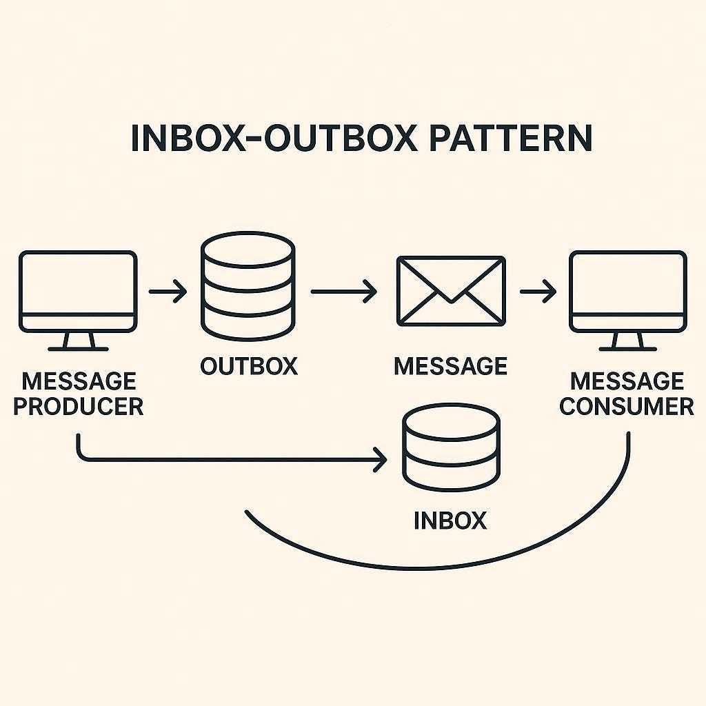
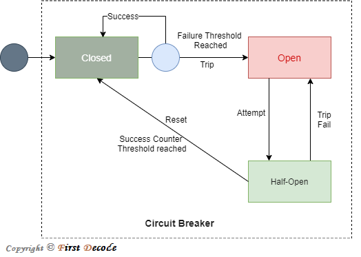

[Back to interview](../interview.md)

# Patterns

<!-- TOC -->
* [Patterns](#patterns)
  * [📥 Inbox pattern](#-inbox-pattern)
  * [📤 Outbox pattern](#-outbox-pattern)
  * [Inbox vs Outbox pattern](#inbox-vs-outbox-pattern)
  * [🔄 Saga pattern](#-saga-pattern)
  * [🔌 Circuit breaker pattern](#-circuit-breaker-pattern)
<!-- TOC -->

## 📥 Inbox pattern

The Inbox Pattern is a reliable messaging design pattern in microservices used on the consumer side to ensure exactly-once processing. 
While most message brokers provide "at-least-once" delivery, the Inbox Pattern **prevents a service from processing the same message multiple times** due to network retries or crashes.

ℹ️ **What problem does it solve?**

The Inbox Pattern guarantees idempotent message consumption.

It answers:

> “What if the same message is delivered more than once?”

(Because at-least-once delivery is the default in most brokers.)

ℹ️ **Core idea**

> Persist incoming message metadata before processing, and process each message only once.

The consumer remembers what it has already processed.

ℹ️ **How It Works**

1. **Message Receipt**: The consumer service receives a message from a broker (like Kafka or RabbitMQ).
2. **Deduplication Check**: Before executing any logic, the service checks an inbox table in its database for the unique `message_id`.
3. **<span style='color:cornflowerblue'>Atomic Transaction</span>**: In a single database transaction, the service:
   1. Inserts the new `message_id` into the inbox table to mark it as "received".
   2. Executes the required business logic (e.g., updating an inventory count).
4. **Acknowledgment**: Once the transaction commits, the message is acknowledged to the broker. If the same message arrives again, the inbox check will find the existing ID and skip processing.

ℹ️ **Key Benefits**

✅ **Idempotency**: Guarantees that even if a message is delivered multiple times, the business state is only updated once.  
✅ **Resilience**: If the service crashes mid-processing, the database transaction rolls back, allowing the message to be safely retried later without partial data corruption.  
✅ **Auditing**: The inbox table serves as a historical log of all events processed by that specific service, aiding in debugging and monitoring.  

---
<div style="break-after: page;"></div>

## 📤 Outbox pattern

ℹ️ **What problem does it solve?**

The Outbox Pattern guarantees reliable event publishing when a service updates its database and needs to notify other systems (via Kafka, RabbitMQ, SQS, etc.).

It solves the classic problem:

> “What if my database transaction commits, but sending the event fails?”

ℹ️ **Core idea**

>Persist events in the same database transaction as business data, then publish them asynchronously.

The database becomes the source of truth, not the message broker.

ℹ️ **How It Works**

1. Business logic executes
    1. Example: OrderPlaced
2. Single database transaction
   1. Update domain tables (e.g. orders)
   2. Insert event into an outbox table
3. Transaction commits
   1. Data + event are now safely stored
4. Outbox publisher runs
   1. Reads unpublished outbox records
5. Event is published
   1. Sent to Kafka / RabbitMQ / SNS / etc.
6. Outbox entry is marked as published or deleted after successful delivery

ℹ️ **Key Benefits**

✅ **Guaranteed Delivery**: Messages are sent if and only if the original database transaction commits, ensuring eventual consistency.  
✅ **No 2PC Required**: It avoids the complexity and performance penalties of Two-Phase Commit (2PC) by using the local database's ACID properties.  
✅ **Resilience**: If the message broker is temporarily down, the outbox acts as a persistent buffer until the connection is restored.  

---
<div style="break-after: page;"></div>

## Inbox vs Outbox pattern

| Pattern        | Side     | Primary Goal                                                                                 |
|----------------|----------|----------------------------------------------------------------------------------------------|
| Outbox Pattern | Producer | **Reliable Send**: Ensures an event is published only if the database transaction succeeds.  |
| Inbox Pattern  | Consumer | **Reliable Receive**: Ensures a received event is processed exactly once without duplicates. |



---
<div style="break-after: page;"></div>

## 🔄 Saga pattern

ℹ️ **What problem does it solve?**

The Saga Pattern manages data consistency across multiple services without distributed transactions.

It answers:

> “How do I keep the system consistent when a business process spans multiple services and something fails halfway?”

ℹ️ **Core idea**

>A saga is a sequence of local transactions, each with a compensating action.

If one step fails, previous successful steps are undone via compensations.

ℹ️ **How it works (step by step)**

**Example: Order processing**

1. Order Service creates an order
2. Payment Service charges the customer
3. Inventory Service reserves items
4. Shipping Service schedules delivery

If step 3 fails:

- payment is refunded
- order is cancelled

ℹ️ **Two Saga styles** 

1️⃣ **Choreography-based Saga**

Each service:
- reacts to events
- emits new events
- knows only its local responsibility

Flow example:

```java
OrderCreated →
PaymentProcessed →
InventoryReserved →
ShippingScheduled
```

If failure:

```java
InventoryFailed →
PaymentRefunded →
OrderCancelled
```

✅ Fully decoupled  
⚠️ Harder to reason about flow  
⚠️ Business logic spread across services  

2️⃣ **Orchestration-based Saga**

A Saga Orchestrator controls the flow.

Flow example:
```html
Orchestrator →
    OrderService →
    PaymentService →
    InventoryService →
    ShippingService
```

On failure:

- orchestrator triggers compensations explicitly

✅ Centralized control  
✅ Easier debugging & monitoring  
⚠️ Orchestrator can become complex  

ℹ️ **Key benefits**

✅ No distributed transactions
- Avoids 2PC and XA

✅ Scales well
- Each step is a local transaction

✅ Explicit business recovery logic
- Compensations are business-defined

✅ Cloud- and microservice-friendly

ℹ️ **Trade-offs**

⚠️ Eventual consistency  
⚠️ Compensations can be complex  
⚠️ Harder than ACID transactions  
⚠️ Requires strong domain understanding  

---
<div style="break-after: page;"></div>

## 🔌 Circuit breaker pattern

ℹ️ **What problem does it solve?**

The Circuit Breaker Pattern prevents cascading failures when calling unreliable or overloaded services.

It answers:

> “How do I stop a failing service from taking the whole system down?”

ℹ️ **Core idea**

> Stop calling a failing dependency temporarily and fail fast.

Instead of retrying endlessly, the system protects itself.

ℹ️ **How it works (step by step)**

1️⃣ **Closed (normal state)**
- Requests flow normally
- Failures are counted

2️⃣ Open (tripped)
- Failure threshold exceeded
- Calls are immediately rejected
- Optional fallback is executed

3️⃣ Half-Open (probing)
- Limited test requests allowed
- If successful → back to Closed
- If failure → Open again

ℹ️ **Circuit states**

`CLOSED → OPEN → HALF-OPEN → CLOSED`



ℹ️ **Key benefits**

✅ Prevents cascading failures  
✅ Fast failure instead of timeouts  
✅ Protects threads & resources  
✅ Improves system stability  

ℹ️ **Trade-offs**

⚠️ Requests may fail even if service recovers briefly  
⚠️ Requires tuning thresholds and timeouts  
⚠️ Needs fallback strategy  

---
<div style="break-after: page;"></div>
